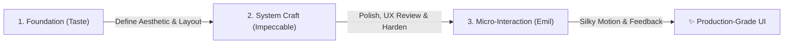

# AI Agent Skills — Installation & Usage Guide

A curated guide and reference manual for installing and mastering frontend design, motion engineering, and UI craft skills across three primary suites: **Emil Kowalski**, **Impeccable**, and **Taste**.

---

## Table of Contents

1. [Installation Guide](#-installation-guide)
2. [Skill Groups & Reference](#-skill-groups--reference)
   - [Group 1: Emil Kowalski Suite](#group-1-emil-kowalski-skills-emilkowalskiskills)
   - [Group 2: Impeccable Suite](#group-2-impeccable-design-suite-impeccable)
   - [Group 3: Taste Suite](#group-3-taste-frontend-suite-taste-skill)
3. [How to Use & Combine Skills](#-how-to-use--combine-skills)
4. [Prompting Cheatsheet](#-prompting-cheatsheet)

---

## 📦 Installation Guide

### Prerequisites
- Node.js (v18+) & `npx` installed.
- An AI Agent runtime supporting skill specifications (e.g., Antigravity, Claude Code, Cursor, Codex).

### One-Line Install Commands

```bash
# 1. Install Emil Kowalski's full skills suite
npx skills@latest add emilkowalski/skills

# 2. Install the Impeccable design system skill & toolchain
npx impeccable install

# 3. Install the Taste (Anti-Slop Frontend) skill
npx skills add https://github.com/Leonxlnx/taste-skill --skill "design-taste-frontend"
```

### Granular Installation (Installing Individual Skills)

If you prefer to install specific skills individually from `emilkowalski/skills`:

```bash
# Core design engineering & motion
npx skills@latest add emilkowalski/skills --skill emil-design-eng
npx skills@latest add emilkowalski/skills --skill animate
npx skills@latest add emilkowalski/skills --skill animate-expo
npx skills@latest add emilkowalski/skills --skill improve-animations
npx skills@latest add emilkowalski/skills --skill find-animation-opportunities
npx skills@latest add emilkowalski/skills --skill review-animations
npx skills@latest add emilkowalski/skills --skill animation-vocabulary

# Platform & UI libraries
npx skills@latest add emilkowalski/skills --skill apple-design
npx skills@latest add emilkowalski/skills --skill ask-sonner
npx skills@latest add emilkowalski/skills --skill pick-ui-library
npx skills@latest add emilkowalski/skills --skill prototype
npx skills@latest add emilkowalski/skills --skill write-swift
```

---

## 🗂 Skill Groups & Reference

```
┌──────────────────────────────────────────────────────────────────────────┐
│                             AGENT SKILLS                                │
├──────────────────────────┬─────────────────────────┬─────────────────────┤
│      EMIL KOWALSKI       │       IMPECCABLE        │        TASTE        │
│   Motion & Interaction   │ Full-Surface System & UX│ Anti-Slop & Vibe    │
├──────────────────────────┼─────────────────────────┼─────────────────────┤
│ • emil-design-eng        │ • shape / init / craft  │ • design-read       │
│ • animate (Web)          │ • critique / audit      │ • 3-dial tuning     │
│ • animate-expo (Mobile)  │ • polish / distill      │ • anti-default      │
│ • apple-design           │ • bolder / quieter      │ • bespoke landing   │
│ • ask-sonner             │ • delight / overdrive   │ • portfolio & brand │
│ • improve-animations     │ • typeset / colorize    │                     │
└──────────────────────────┴─────────────────────────┴─────────────────────┘
```

---

### Group 1: Emil Kowalski Skills (`emilkowalski/skills`)

Focuses on **micro-interactions, physical motion curves, gesture handoffs, Apple-level polish, and invisible interaction craft**.

| Skill Name | Purpose | When to Use |
|---|---|---|
| **`emil-design-eng`** | Emil's design philosophy | Building polished UI components, setting micro-interactions, layout rhythms, and hover/active states. |
| **`animate`** | Web animation implementation | Crafting transitions from scratch (Framer Motion, CSS, GSAP) with correct durations, spring physics, and exit transitions. |
| **`animate-expo`** | React Native & Expo motion | Building gestures, bottom sheets, fluid transitions, and haptics using Reanimated, Gesture Handler, and `expo-haptics`. |
| **`apple-design`** | Apple interface aesthetics | Replicating iOS/macOS tactile feel: translucent vibrancy, spring physics, optical typography, and spatial consistency. |
| **`ask-sonner`** | Sonner toast notifications | Installing, positioning, styling, and wiring up `toast()` calls (promise toasts, custom JSX, dark mode, action buttons). |
| **`improve-animations`** | Codebase motion audit | Surveying an existing app to produce a prioritized roadmap and audit of broken or awkward animations. |
| **`find-animation-opportunities`** | Motion discovery | Scanning static UI code to pinpoint missed opportunities for delight and micro-motion. |
| **`review-animations`** | Animation PR review | Critiquing a specific motion diff for curve correctness, jank, interruptibility, and performance. |
| **`animation-vocabulary`** | Motion terminology lookup | Translating vague descriptions ("the bouncy spring popover thing") into precise industry terms. |
| **`pick-ui-library`** | Stack advisory | Choosing the right component library, styling solution, or animation engine for a new project. |
| **`prototype`** | Fast interaction prototyping | Quick-and-dirty interactive UI mocks with state exploration before final architecture. |
| **`write-swift`** | Modern Swift 6 engineering | Idiomatic Swift, Swift 6 concurrency, actors, `@MainActor`, Swift Testing, and ARC safety. |

#### How to Use Emil Skills
* **Conversational Trigger:** Ask for tactile micro-interactions, smooth springs, gesture handling, or toast notifications.
* **Example Prompts:**
  * *"Refactor this accordion menu using the `emil-design-eng` philosophy—make the open/close feel tactile with crisp micro-interactions."*
  * *"Use `animate` to build an interruptible modal transition with spring physics in Framer Motion."*
  * *"Use `animate-expo` to create a swipe-to-dismiss bottom sheet with haptic feedback on iOS."*
  * *"Audit the motion across this dashboard with `improve-animations` and outline what feels janky."*

---

### Group 2: Impeccable Design Suite (`impeccable`)

An **autonomous design director** for end-to-end interface craft, UX design reviews, component systems, and surgical UI commands.

#### Operating Modes
1. **Persuade:** Landing pages, marketing, campaigns, pricing (high visual expression).
2. **Operate:** App UI, dashboards, tools, settings, tables (scanability, efficiency, native conventions).
3. **Read:** Documentation, articles, blogs, help centers (typography, rhythm, reading flow).
4. **Experience:** Portfolios, showcases, galleries (artifact leads, UI recedes).

#### Core Command Matrix

| Category | Command | Action |
|---|---|---|
| **Build** | `shape [feature]` | Plan UX/UI architecture and flows before writing code. |
| | `init` | Capture product context and create `PRODUCT.md`. |
| | `document` | Reverse-engineer an existing codebase into `DESIGN.md`. |
| | `extract [target]` | Pull reusable tokens, colors, and components into a cohesive design system. |
| **Evaluate** | `critique [target]` | Heuristic UX review scoring usability, visual hierarchy, and cognitive load. |
| | `audit [target]` | Technical quality checks (WCAG accessibility, responsiveness, layout shift). |
| **Refine** | `polish [target]` | Final quality pass to remove alignment bugs and visual awkwardness. |
| | `bolder [target]` | Amplify bland or timid designs with strong hierarchy and punchy contrast. |
| | `quieter [target]` | Tone down overstimulating, noisy, or chaotic interfaces. |
| | `distill [target]` | Strip away unnecessary chrome and simplify dense screens. |
| | `harden [target]` | Make production-ready: handle error states, long text, zero-states, and i18n. |
| | `onboard [target]` | Design empty states, first-run walkthroughs, and activation moments. |
| **Enhance** | `typeset [target]` | Upgrade typographic hierarchy, font pairings, tracking, and leading. |
| | `colorize [target]` | Introduce strategic accent colors and semantic palettes. |
| | `layout [target]` | Fix spatial rhythm, grid alignment, padding, and optical balance. |
| | `delight [target]` | Inject personality, memorable easter eggs, and playful micro-details. |
| | `overdrive [target]` | Push past conventional constraints into award-winning experimental territory. |
| **Fix & Test** | `clarify [target]` | Rewrite confusing copy, button labels, and system messages. |
| | `adapt [target]` | Ensure flawless rendering across mobile, tablet, and widescreen viewports. |
| | `optimize [target]` | Diagnose and repair UI render bottlenecks and DOM bloat. |

#### How to Use Impeccable
* **Conversational Trigger:** Use slash commands or request comprehensive UI builds/refinements.
* **Example Prompts:**
  * `"/impeccable shape checkout-flow"`
  * `"/impeccable critique src/components/Dashboard.tsx"`
  * *"This landing page looks generic. Run `/impeccable bolder` and give it a distinctive visual world."*
  * *"Run `/impeccable harden` on our settings page to add empty states, error boundaries, and loading skeletons."*

---

### Group 3: Taste Frontend Suite (`taste-skill`)

An **anti-slop frontend design engine** specialized for landing pages, creator portfolios, and high-impact redesigns.

#### The Three Core Pillars
1. **Brief Inference (The "Design Read"):** Before writing code, the agent analyzes audience, page kind, vibe keywords, and brand assets, outputting a clear design thesis.
2. **Anti-Default Discipline:** Deliberately rejects generic LLM aesthetics:
   - ❌ *No generic purple/blue mesh gradients*
   - ❌ *No generic 3-column equal card layouts*
   - ❌ *No unconsidered Inter + slate-900 combinations*
   - ❌ *No gratuitous floating glassmorphism*
3. **The 3 Dials System:**
   - `DESIGN_VARIANCE` (1 = Strict Symmetry $\leftrightarrow$ 10 = Artsy Chaos)
   - `MOTION_INTENSITY` (1 = Static $\leftrightarrow$ 10 = Cinematic / Physics)
   - `VISUAL_DENSITY` (1 = Airy Gallery $\leftrightarrow$ 10 = Cockpit / Data-dense)

#### Dial Profiles

| Style / Intent | Variance | Motion | Density |
|---|---|---|---|
| **Minimalist / Linear-style** | `5–6` | `3–4` | `2–3` |
| **Premium Consumer / Apple-y** | `7–8` | `5–7` | `3–4` |
| **Awwwards / Experimental Agency** | `9–10` | `8–10` | `3–4` |
| **Standard SaaS / Marketing (Default)** | `8` | `6` | `4` |
| **Trust-First / Public Sector** | `3–4` | `2–3` | `4–5` |

#### How to Use Taste
* **Conversational Trigger:** Mention landing page builds, portfolio redesigns, or request bespoke non-templated styling.
* **Example Prompts:**
  * *"Build a landing page for our developer CLI tool using `design-taste-frontend`. Vibe: dark tech, high variance, restrained motion."*
  * *"Redesign my personal portfolio. Use `design-taste-frontend` with dial settings `VARIANCE: 9`, `MOTION: 8`, `DENSITY: 3`."*
  * *"Create a hero section that does not look like typical AI-generated SaaS templates."*

---

## ⚡ How to Use & Combine Skills

The three suites are complementary and can be chained together for best results:



### Combined Workflow Example

1. **Ideation & Identity (Taste):**
   > *"Using `design-taste-frontend`, generate the layout and visual world for our new developer analytics product."*
2. **Refinement & UX Robustness (Impeccable):**
   > *"Run `/impeccable harden` and `/impeccable typeset` on the generated components to ensure accessibility and responsive perfection."*
3. **Micro-Interactions & Motion (Emil):**
   > *"Apply `emil-design-eng` and `animate` to make our interactive charts and tooltips feel springy and tactile."*

---

## 💡 Prompting Cheatsheet

| If you want to... | Use Skill | Say this... |
|---|---|---|
| **Build a distinctive landing page** | `design-taste-frontend` | *"Build this landing page using `design-taste-frontend`. Make it editorial and distinct."* |
| **Fix a clunky transition** | `animate` | *"Fix this dropdown transition using `animate` with natural spring damping."* |
| **Add gestures to a mobile app** | `animate-expo` | *"Implement a sheet pull gesture using `animate-expo` with haptic feedback."* |
| **Review an entire screen's UX** | `impeccable` | *"`/impeccable critique` on the onboarding funnel."* |
| **Add instant toast feedback** | `ask-sonner` | *"Set up `ask-sonner` with promise toasts for async form submissions."* |
| **Make a boring UI look premium** | `impeccable` / `apple-design` | *"Apply `apple-design` to give these cards subtle blur depth and optical typography."* |
| **Review animation performance** | `review-animations` | *"Review this animation PR diff for 60fps frame drops and curve timing."* |

